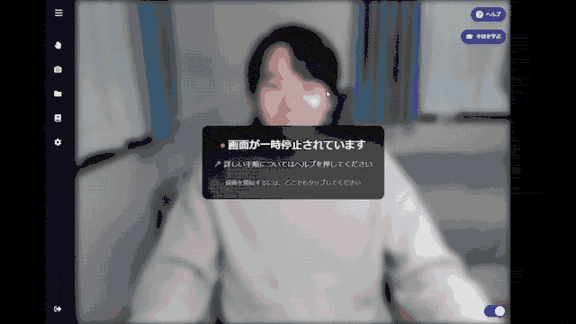

# Handy

Real-time sign language recognition that learns a new sign from two recordings — no retraining, no fine-tuning, no GPU.

Most sign recognition systems are closed-vocabulary classifiers: adding a sign means collecting data and retraining. Handy embeds hand motion into a metric space instead, so registering a sign is just storing a couple of examples and comparing against them. Recording a new sign and having it recognised takes about ten seconds.

<!-- TODO before publishing: record a ~15s screen capture (countdown → sign → subtitle
     appears → register a brand-new sign → it is recognised immediately), save it as
     docs/demo.gif, and uncomment the line below.

-->

## Quick start

You need Node.js with Yarn, Python 3.10–3.12, and a webcam.

```bash
yarn
pip install -r server/requirements.txt
```

Run the server and the web app in two terminals, both from the repository root:

```bash
python server/server.py   # websocket server on :8765
yarn start                # web app on :3000
```

Open <http://localhost:3000> and create an account. Accounts are stored locally in
`server/login/users.json`, which is created on first signup and is not tracked in
git — the server binds to `127.0.0.1` and is a single-user local application.

**The sign database starts empty**, so nothing will be recognised until you record something. Go to *Record*, click to start, and sign after the three-second countdown — open your mouth to stop. Record each sign twice: the rejection threshold is calibrated from a leave-one-out fit over your own recordings, and it needs at least two per class to do that. With two classes registered, the dashboard starts producing subtitles.

## How it works

```
webcam frame ──▶ MediaPipe Hands ──▶ (30, 42, 3) landmarks
                                          │
                                    CNN + TCN encoder
                                          │
                                    (30, 256) embedding
                                          │
                                  partial DTW vs. prototypes
                                          │
                                  calibrated threshold ──▶ subtitle
```

The browser captures a frame every 50 ms and ships it over a websocket as base64 JPEG. The server extracts 42 hand keypoints per frame with MediaPipe, buffers 30 frames, and encodes them into a 256-dimensional per-frame embedding. Classification is a partial DTW alignment against every stored prototype, which absorbs differences in signing speed and handles a query that only partially overlaps a sign.

Two details matter for making this work on a live stream rather than on pre-segmented clips:

- **The no-match threshold is calibrated, not hardcoded.** A fixed threshold either fires constantly or never fires at all — the original 0.9 never fired once in benchmarking. Handy takes the leave-one-out distances of your own registered recordings and uses their median as the rejection threshold, recomputed whenever you add or delete a sign.
- **Detection failures are handled explicitly.** MediaPipe fails to find a hand in roughly 38% of WLASL frames. Treating those as zero-filled landmarks puts a "ghost pose" at the origin that aligns cheaply with anything; decaying the last known pose and discarding unrecoverable windows instead was worth about 8 points of accuracy.

Architecture and the websocket protocol are documented in [docs/ARCHITECTURE.md](docs/ARCHITECTURE.md).

## Research

Handy is also the subject of an ongoing research project on few-shot sign recognition, evaluated on WLASL under a class-disjoint protocol where the evaluation classes are never seen during training.

- **Paper** (Japanese) — [`rmd/2026_yota_wip_resumefinal-2.pdf`](rmd/2026_yota_wip_resumefinal-2.pdf)
- **Poster** (Japanese) — [`rmd/yota_WIP_poster.pdf`](rmd/yota_WIP_poster.pdf)
- **Code** — [`experiments/`](experiments/), with reproduction instructions in [experiments/README.md](experiments/README.md)

Headline results, all on classes disjoint from the training vocabulary:

| Change | Effect |
|---|---|
| Detection fallback for missing hands | 5-way 1-shot 44.1% → 52.7% |
| DBA prototype aggregation | 4.6× faster inference, at a cost of 4–5 points |
| Soft-DTW loss on L2-normalised embeddings | 10-way 5-shot transfer 67.1% → 76.1% |
| Conformal threshold calibration | Continuous-stream WER 280% → 83.1%, no manual tuning |

Continuous recognition is **not solved**. Exact sequence match on the continuous benchmark is 0%, and the calibrated decoder still substitutes the wrong sign most of the time. The gap between isolated-clip accuracy and continuous-stream performance is the main open problem, and the benchmark that measures it is in `experiments/continuous_bench.py`.

A negative result worth recording: making the DTW loss differentiable via Soft-DTW did *not* help on its own — accuracy degraded monotonically in γ. It only produced positive transfer after the embeddings were constrained to the unit sphere, which removed a degenerate solution where the loss was minimised by shrinking the embedding scale.

## Repository layout

```
src/            React frontend (TypeScript)
server/         Python websocket server: MediaPipe, embedding model, DTW matching
experiments/    Research code — evaluation harness, Soft-DTW, DBA, benchmarks
train/          Original Colab training notebooks
rmd/            Paper, poster, and figure generation
```

## Credits

The Handy application — the React frontend, the websocket server, and the original
embedding model in `server/model/weights.h5` — was **co-developed with Allen Lee**,
who also wrote the training notebooks in `train/`.

The research contribution in `experiments/` and `rmd/` (the evaluation harness, the
detection fallback, DBA prototype aggregation, the batched Soft-DTW implementation,
the continuous-stream benchmark, and conformal threshold calibration) is my own work,
carried out at the Nakazawa–Ohkoshi Laboratory, Faculty of Policy Management, Keio
University.

If you use this work, please cite it — see [CITATION.cff](CITATION.cff).

## License

Code is licensed under the [Apache License 2.0](LICENSE); see [NOTICE](NOTICE) for
attribution requirements. The paper, poster, and figures under `rmd/` are licensed
under [CC BY 4.0](LICENSE-docs). The notebooks in `train/` are excluded from both
grants — see [train/README.md](train/README.md).

Third-party material is not redistributed here: the WLASL dataset must be obtained
from its own maintainers, and the favicon is used under the
[Flaticon Basic License](https://www.flaticon.com/free-icons/sign-language).
